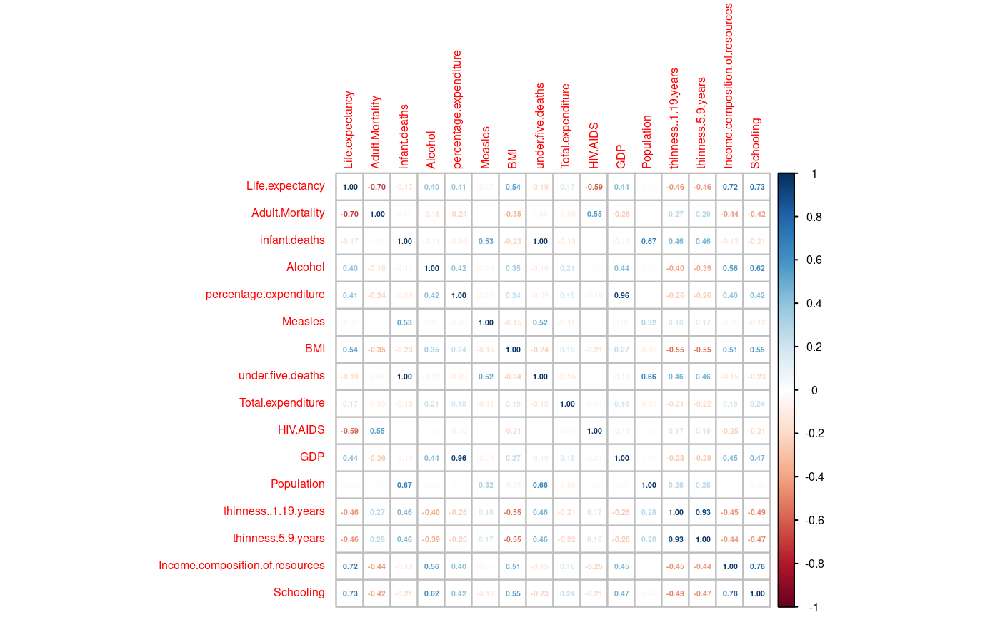

# Life Expectancy Prediction

## Abstract
We have implemented a Linear Regression model to predict the life expectancy of the human population with our best model having an adjusted R-squared value of 0.8239, RMSE of 3.71, and MAE of 2.85, from the processed dataset having ~1650 observations  of ~20 variables related to life expectancy and health factors for 193 countries provided by the Global Health Observatory (GHO) data repository under the World Health Organization (WHO). Several model building techniques including Forward Selection, Backward Elimination, and Stepwise Regression were used to obtain the candidate models, which were then evaluated with K-Fold Cross Validation to yield the model with the lowest RMSE value. Our best model passes the normality assumption and has no issues with the multicollinearity of the variables.

**View the analysis [here](https://github.com/Vipul97/life-expectancy-prediction/blob/main/life_expectancy_prediction.pdf) and the R Markdown code [here](https://github.com/Vipul97/life-expectancy-prediction/blob/main/life_expectancy_prediction.Rmd).**

## Data Source
The data related to life expectancy and health factors for 193 countries is taken from the Global Health Observatory (GHO) data repository under the World Health Organization (WHO). Its corresponding economic data was collected from the United Nations website for a period of 16 years (2000-2015).

The dataset is available at https://www.kaggle.com/datasets/kumarajarshi/life-expectancy-who.

+ `Country` - Country Observed.
+ `Year` - Year Observed.
+ `Status` - Developed or Developing status.
+ `Life.expectancy` - Life Expectancy in age.
+ `Adult.Mortality` - Adult Mortality Rates on both sexes (probability of dying between 15-60 years/1000 population).
+ `infant.deaths` - Number of Infant Deaths per 1000 population.
+ `Alcohol` - Alcohol recorded per capita (15+) consumption (in litres of pure alcohol).
+ `percentage.expenditure` - Expenditure on health as a percentage of Gross Domestic Product per capita (%).
+ `Hepatitis.B` - Hepatitis B (HepB) immunization coverage among 1-year-olds (%).
+ `Measles` - Number of reported Measles cases per 1000 population.
+ `BMI` - Average Body Mass Index of entire population.
+ `under.five.deaths` - Number of under-five deaths per 1000 population.
+ `Polio` - Polio (Pol3) immunization coverage among 1-year-olds (%).
+ `Total.expenditure` - General government expenditure on health as a percentage of total government expenditure (%).
+ `Diphtheria` - Diphtheria tetanus toxoid and pertussis (DTP3) immunization coverage among 1-year-olds (%).
+ `HIV.AIDS` - Deaths per 1000 live births due to HIV/AIDS (0-4 years).
+ `GDP` - Gross Domestic Product per capita (in USD).
+ `Population` - Population of the country.
+ `thinness..1.19.years` - Prevalence of thinness among children and adolescents for Age 10 to 19 (%).
+ `thinness.5.9.years` - Prevalence of thinness among children for Age 5 to 9 (%).
+ `Income.composition.of.resources` - Human Development Index in terms of income composition of resources (index ranging from 0 to 1).
+ `Schooling` - Number of years of Schooling (years).

### Correlation Plot

## Results

Our model contains 12 variables: `Schooling`, `HIV.AIDS`, `Adult.Mortality`, `Income.composition.of.resources`, `BMI`, `GDP`, `Diphtheria>=90% Covered`, `Alcohol`, `thinness..1.19.years`, `Status`, `Hepatitis.B>=90% Covered`, and `Total.expenditure`.

The estimates for the model are derived from the results of K-Fold Cross Validation (K = 5), and are summarized in the following table:

|  Metric   | Estimate  |
|----------:|:---------:|
| R-squared | 0.8219568 |
| RMSE      | 3.711009  |
| MAE       | 2.846318  |
